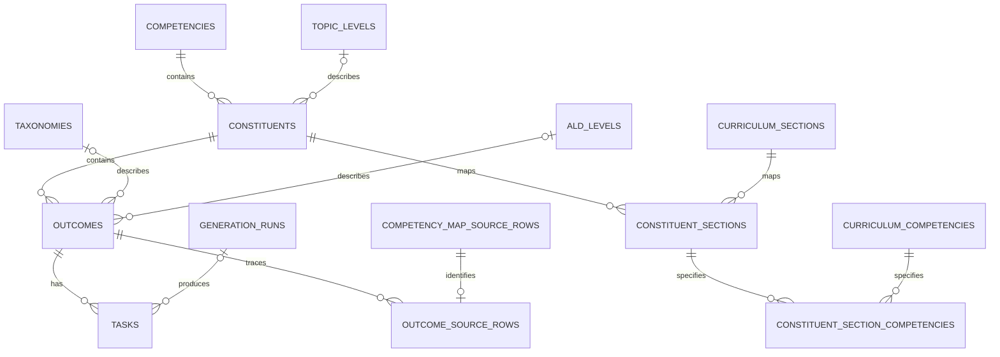

# План схемы карты компетенций

Дата дизайна: **2026-10-05**. Статус реализации: **обновлён 2026-10-06**. Поскольку реальных данных нет, целевая схема собрана в одной начальной миграции без backfill и промежуточных миграционных файлов. SQLC-репозитории, CSV/XLSX импорт, каталог и генерация реализованы; прогресс — в разделе 7. Схема: [начальная SQL-миграция](services/backend/internal/shared/postgres/migrations/00001_initial.sql).

## 1. Продуктовые решения

1. «Инстанс» — условное название согласованного набора свойств, отдельная бизнес-сущность не нужна. Набор определяется ОР и его связями: составляющая, компетенция, учебные свойства, РПД, ОС, задания.
2. Все таблицы, поля и коды — английские; русские тексты и подписи хранятся как данные. ОР — тема, отдельного `topics` не создаём.
3. ОС соответствует одному ОР, и у ОР одна ОС. Отсутствующий текст не выдумываем.
4. Задания 1–3 — равнозначные аналоги одного ОР. Номер колонки не означает сложность, приоритет, основной/базовый/тренировочный тип. Пустая ячейка — отсутствие задания.
5. Задания ИИ хранятся рядом с авторскими, имеют явное происхождение и сразу после успешного сохранения доступны студентам; этап согласования преподавателем не предусмотрен.
6. Повторный импорт заменяет все данные карты, связанные задания обоих происхождений и производные поисковые данные. Ошибка импорта оставляет прежнюю карту. Учётные записи и расшифровки к карте не относятся.
7. Связи нужны для подбора задач по свойствам, поиска аналогов, RAG, генерации и объяснимой диагностики пробелов. Само наличие связи не является доказательством пробела: нужны сохранённые результаты ответов.

## 2. Ревью текущего хранения

| Наблюдение по коду/CSV | Что улучшить |
| --- | --- |
| `tasks.outcome_id → outcomes.constituent_id → constituents.competency_id` уже существует. | Сохранить FK-цепочку и получать весь профиль одним запросом. Не копировать названия/свойства в каждое задание. |
| Старые свойства карты были представлены JSON-массивом `outcomes.attributes` с русскими ключами. | Использовать типизированные поля и FK. Исходные строки целиком хранятся в архиве источника; дублирующий JSON столбец не нужен. |
| Уровень темы и РПД заполнены в 17 началах блоков составляющих; внутри одной компетенции разные уровни/разделы. | Хранить эти связи у составляющей и наследовать внутри её блока. Не переносить их на компетенцию целиком. |
| В ячейке РПД смешаны раздел и список кодов; для одного раздела списки кодов у разных составляющих различаются. | Разделить справочники и сохранить коды в контексте конкретной связи «составляющая–раздел». Глобальное объединение кодов раздела потеряет соответствие. |
| ОС заполнена у 18 из 101 ОР. | `outcomes.educational_content text NULL` достаточно для 1:1; отсутствующий текст остаётся `NULL`. |
| В ML `Ответ:` сейчас записывается в `tasks.criteria`. | Выделить `reference_answer`; критерии парного формата сохранить отдельно и без интерпретации. |
| `source_row` — физическая строка; исходные записи имеют логический `row_index`; FK между ними нет. | Добавить явные ссылки на исходную запись и колонку, сохранять обе координаты. |
| Повторный импорт удаляет иерархию, но сохраняет прежние `competency_map_imports` и исходные строки. | Привести замену к согласованному удалению старого содержимого карты; оставить монотонный счётчик для проверки актуальности операций. |
| Нет происхождения заданий и ссылок на запуск генерации. | `tasks.origin`, метаданные генерации и ссылки на примеры/учебный контекст. |

**Состояние исходного CSV:** 13 компетенций, 17 составляющих, 101 ОР; 18 ОР отмечены `TRUE`; 54 непустые ячейки заданий, из которых только 13 самостоятельные, а 41 — фрагменты. Непустые фрагменты не равны пустым ячейкам. Их сохраняем с диагностикой, не склеиваем по догадке и не выдаём студентам. Поясняющая строка и заметки «ПРОВЕРИТЬ: НЕТ В РПД» сохраняются в исходнике, но не становятся ОР.

## 3. Целевая модель и соответствие колонок

Сохраняем существующие имена `competencies`, `constituents`, `outcomes`, `tasks` и текущую структуру родителей. В этой карте один ОР принадлежит одной составляющей, составляющая — одной компетенции. Одинаковое название под разными родителями не означает одну запись. Связи многих родителей с одним ОР можно добавить позднее при появлении такого источника; текущий CSV их не задаёт.

| Колонка / понятие | Хранение | Связь / правило |
| --- | --- | --- |
| Компетенция | `competencies(id, name, revision)` | Импорт 1:N компетенции; уникальность имени внутри карты. |
| Составляющая | `constituents(id, competency_id, name, topic_level_id)` | Компетенция 1:N составляющие; имя уникально внутри родителя. |
| Образовательный результат | `outcomes(id, constituent_id, name, ...)` | Составляющая 1:N ОР; имя уникально внутри родителя. |
| Что должно войти в тест | `outcomes.include_in_test boolean` | Одно значение ОР; фильтр включения при подборе диагностики. `FALSE` не означает пробел знаний. |
| Таксономия | `outcomes.taxonomy_id → taxonomies.id` | Один таксономический уровень ОР, справочник 1:N ОР. |
| Уровень ALDs | `outcomes.ald_level_id → ald_levels.id` | Один ALDs ОР, справочник 1:N ОР. |
| Важность | `outcomes.importance smallint` | `CHECK (importance BETWEEN 1 AND 5)`, шкала из пояснения карты. |
| Уровень темы | `constituents.topic_level_id → topic_levels.id` | Один уровень составляющей, наследуется её ОР и заданиями. ALDs хранится отдельно. |
| Раздел РПД | `curriculum_sections(id, revision, code, title)`; `constituent_sections(id, constituent_id, section_id)` | Составляющая N:M разделы; уникальная пара. |
| Компетенции РПД | `curriculum_competencies(id, revision, code)`; `constituent_section_competencies(constituent_section_id, curriculum_competency_id)` | Коды относятся к конкретной паре «составляющая–раздел», PK на паре ссылок. Это другой справочник, чем компетенции карты. |
| ОС | `outcomes.educational_content text NULL` | Одна ОС на ОР без дополнительной связующей таблицы; отсутствие текста допустимо. |
| Задание 1–3 | `tasks.outcome_id → outcomes.id` | ОР 1:N задания; общий профиль определяется ОР и его родителями. Колонки — только происхождение. |

`taxonomies`, `ald_levels`, `topic_levels`: `id`, уникальный `code`, `label`. Для текущего источника таксономия: `knowledge`, `understanding`, `application`, `analysis`; ALDs/уровень темы: `basic`, `intermediate`, `advanced` в **разных** справочниках. Регистр и известные варианты подписей нормализуются явно, исходное значение сохраняется в CSV-строке.

Для ML обязательны `include_in_test`, `taxonomy_id`, `ald_level_id`, `importance` и разрешённые значения; у составляющей разрешается наследование уровня/РПД только в её блоке. Старый парный CSV не содержит этих свойств: допускается `NULL` с признаком неполноты в отчёте, без выдуманных значений. Такие записи не проходят подбор, требующий отсутствующего свойства.

### Задания и происхождение

`tasks`: существующие `id`, `outcome_id`, `question`; упорядоченные `options jsonb` (массив строк, `[]` для задания без вариантов), отдельная `voice_instruction`, необязательные `reference_answer` и `criteria`, `origin` с `CHECK IN ('authored', 'ai_generated')`, `generation_run_id NULL`, `source_revision NULL`, `source_row_index NULL`, `source_column_index NULL`, `created_at`.

- `question` и инструкция самостоятельны: экран использует вопрос/варианты, TTS — инструкцию. Варианты — содержание конкретного задания, отдельная таблица справочника для них не нужна.
- Исходные задания получают `origin=authored` без запуска генерации; сгенерированные — `ai_generated` с обязательной ссылкой на запуск. CHECK проверяет эти сочетания; составной FK `(generation_run_id, outcome_id)` гарантирует совпадение ОР задания и запуска. Данные задания не определяются колонкой CSV при выдаче.
- Ссылка на CSV: составной FK `(source_revision, source_row_index)` к исходной записи, все координаты либо заданы, либо `NULL`. Физическая `source_line` остаётся у исходной записи для сообщений об ошибках; `source_column_index` проверяется относительно сохранённых заголовков при импорте.
- `criteria` парного CSV сохраняется без изменений. Для ML `Ответ:` переходит в `reference_answer`; ОС не подменяет критерии конкретного задания. Эталон необязателен по контракту оценивания; шкала 0/1/2 задаётся системным правилом.
- Авторские и сгенерированные аналоги находятся через `outcome_id`. Их `origin` не меняет учебные свойства. Назначение `main/basic/training` относится к выдаче в сессии; номер исходной колонки не задаёт назначение.

`outcome_source_rows(outcome_id, source_revision, source_row_index)` связывает ОР с исходными строками даже при отсутствии заданий. Составной FK указывает на `competency_map_source_rows`, FK `outcome_id` — на ОР; уникальность `(source_revision, source_row_index)` запрещает приписать одну строку двум ОР. Несколько согласованных исходных строк одного ОР допустимы; пояснения/заметки не получают такую связь.

### Связи на схеме

ОС, включение в тест и важность — поля `OUTCOMES`; остальные связи — FK. Необязательность справочных ссылок нужна для совместимости со старым парным форматом. При нескольких разделах API возвращает список связок `{section, curriculum_competencies}`, сохраняя принадлежность кодов разделу.

## 4. Запросы, ради которых строится схема

1. **Профиль по `task_id`:** вопрос/варианты/инструкция, ОР/ОС, составляющая/уровень темы, компетенция, таксономия, ALDs, важность, включение в тест, связки разделов/компетенций РПД, происхождение. Эталон/критерии добавляются только во внутреннее представление для оценивания/генерации.
2. **Подбор:** фильтры по ОР/составляющей/компетенции, разделу и коду РПД, таксономии, ALDs, уровню темы, диапазону важности, `include_in_test`, происхождению. Точные фильтры выполняются SQL до семантического ранжирования.
3. **Аналоги:** другие `tasks` того же ОР с теми же унаследованными свойствами; исключаются исходный вопрос и уже выданные задания сессии. Схожая формулировка без совпадения свойств не гарантирует аналогичность.
4. **Генерация:** выбранный ОР/его профиль + подходящие примеры + связанные фрагменты материалов → задание с тем же `outcome_id`, `origin=ai_generated` и метаданными запуска.
5. **Пробелы:** сохранённая оценка ответа → ОР → составляющая/компетенция. Непроверенные ОР не считаются неподтверждёнными. Требуются будущие таблицы ответов/оценок и снимки выдач.

Нужен внутренний `task_profiles` (обычный SQL view/запрос, не materialized view по умолчанию). Использовать `EXISTS` для фильтра РПД, чтобы несколько связей не дублировали вопрос в выдаче. Индексы: FK родителей и `tasks(outcome_id, id)`, обратные FK таблиц РПД; составные индексы свойств выбирать по реальным запросам и `EXPLAIN ANALYZE`. Индекс на каждый малоселективный boolean/enum сам по себе не является планом оптимизации.

### Генерация и RAG

- `generation_runs(id, outcome_id, map_revision, model, prompt_version, requested_profile, created_at)` с `UNIQUE(id, outcome_id)` для составного FK; `requested_profile jsonb` — исторический снимок входа, не источник оперативных фильтров. Примеры связываются через `generation_run_examples(generation_run_id, task_id)`; контекст — через `generation_run_chunks(generation_run_id, chunk_id)` после появления материалов.
- Сетевой вызов LLM выполняется **вне** транзакции БД. Перед сохранением под блокировкой карты проверяется исходная ревизия: если импорт уже заменил карту, результат не сохраняется под новыми ОР. При успехе запуск, ссылки и задание сохраняются одной транзакцией; оно сразу попадает в выдачу без отдельной публикации.
- Проверяется структура результата, непустой вопрос/инструкция, формат вариантов, привязка к запрошенному ОР. Это не гарантирует педагогическую правильность: качество генерации потребует отдельных оценок, но не вводит согласование преподавателем.
- Для RAG будущие `material_chunks` связываются FK/таблицами связей с ОР и разделами. Embedding хранит `chunk_id`, модель, размерность и ревизию карты; устаревшие записи не участвуют в поиске. Конкретная модель embeddings и способ vector-хранения выбираются отдельно по данным/нагрузке.
- PostgreSQL остаётся источником отношений; графовая БД для текущего объёма не требуется. JSON допустим для оригинала и снимков, а связи/часто используемые фильтры остаются реляционными.

## 5. Семантика полной замены

Сохраняем одну текущую карту. `competency_map_state.revision` — монотонный номер замены/защита от устаревших операций, **не каталог опубликованных версий**. В `competency_map_imports` и `competency_map_source_rows` после успешного импорта остаётся только текущая карта; прежний CSV и его метаданные удаляются. В конце перехода ограничение singleton у `competency_map_imports` закрепляет наличие не более одной текущей записи импорта.

Перед записью файл полностью разбирается и проверяется. В транзакции блокируется singleton состояния; удаляются старые связи генерации/поисковые данные, задания и запуски генерации, ссылки на источники/ОР, составляющие, связи РПД/справочники карты, компетенции, исходные записи и запись импорта; создаётся новая карта, счётчик увеличивается. Общие справочники уровней/таксономии сохраняются. FK и порядок удаления задаются явно; `TRUNCATE ... CASCADE` всей базы не используется.

Удаляются и авторские, и ИИ-задания старой карты; идентификаторы заново загруженных сущностей не обещают стабильности. Независимые пользователи, токены, расшифровки и исходные файлы учебных материалов не удаляются. При замене карты удаляются связи фрагментов с прежними ОР и embeddings старой ревизии; сами фрагменты остаются неизменяемыми, чтобы завершённые генерации и уже начатые запросы сохраняли ссылки на свой контекст. Материал следует повторно привязать к ОР активной карты.

**Будущая учебная история:** `assignments` сохраняют снимок текста, вариантов, инструкции, эталона/критериев и всего профиля на момент выдачи; ответы/оценки принадлежат этой выдаче. Живая ссылка на задание становится `NULL` при замене карты, снимок остаётся. Начатая сессия не меняет уже закреплённые задания. Ещё не закреплённые ветки нельзя сопоставлять новой карте по совпадению названий: к реализации сессий нужно закреплять нужный учебный граф/доступный банк в снимке сессии. Это исторические данные студента, а не сохраняемая версия активной карты.

## 6. Атомарные шаги реализации

Шаги ниже фиксируют порядок проектирования и критерии проверки. Поскольку реальных данных нет, изменения схемы из шагов 2–4 и 12 уже объединены в одну начальную миграцию. Статус фактической реализации приведён в разделе 7.

### Шаг 1 — контракт и доменные типы

- **Изменение:** типизированные свойства ОР/составляющей, словари, структура связки РПД, происхождение задания и отдельный эталон в доменной модели; DTO отчёта импорта с координатами предупреждений. Зафиксировать пример полного `task_profile`.
- **Проверка/ревью:** каждый столбец карты имеет явное соответствие; `NULL`, `FALSE` и отсутствие задания различаются; ОС единственна; русских имён БД нет. Транспорт/SQL не попадает в domain/application.
- **Зависимости/откат:** нет; старый адаптер можно оставить до следующих шагов.

### Шаг 2 — свойства и справочники в БД

- **Изменение:** новая добавочная миграция для `taxonomies`, `ald_levels`, `topic_levels`, полей ОР (`include_in_test`, `taxonomy_id`, `ald_level_id`, `importance`, `educational_content`) и `constituents.topic_level_id`. Существующие имена/ID таблиц сохраняются. Поля пока nullable для переноса.
- **Проверка/ревью:** FK не принимает неизвестный код, важность вне 1–5 отклоняется, ОС нельзя размножить. Старый импорт/API продолжает работать до переключения.
- **Зависимости/откат:** шаг 1; чтение возвращается на старые поля, новые колонки не удаляются с потерей данных.

### Шаг 3 — связи РПД

- **Изменение:** `curriculum_sections`, `curriculum_competencies`, `constituent_sections`, `constituent_section_competencies`, PK/UNIQUE/FK и обратные индексы. Раздел/код уникальны внутри текущей карты, одна связь не дублируется.
- **Проверка/ревью:** две составляющие одного раздела сохраняют разные наборы кодов; код связан с правильной парой составляющая–раздел; удаление родителя не оставляет сирот.
- **Зависимости/откат:** шаг 2; до переключения старый JSON остаётся доступным.

### Шаг 4 — содержание и происхождение задания

- **Изменение:** `reference_answer`, `origin`, nullable координаты исходника, FK на исходную запись, `outcome_source_rows`, метаданные генерации и связи примеров (без вызова модели). Существующие задания помечаются `authored`; `criteria` допускает отсутствие для формата с отдельным эталоном. Проверка массива `options`; времена совместимы с текущим API (Unix seconds).
- **Проверка/ревью:** авторское задание не требует запуска генерации; `ai_generated` не может сохраниться без него/с другим ОР; варианты имеют порядок; вопрос/инструкция отделены от эталона. Физическая строка не используется как логический индекс. ОР без заданий сохраняет связь с исходником.
- **Зависимости/откат:** шаги 1–2 и существующая миграция источников; старое чтение сохраняется, исходник не теряется.

### Шаг 5 — парсер полного профиля

- **Изменение:** нормализация TRUE/FALSE, таксономии/ALDs/важности; наследование уровня темы/РПД внутри составляющей, сброс при смене родителя; разбор раздела/кодов; ОС только своего ОР. Самостоятельные задания получают эталон, варианты, инструкцию и ссылку на источник. Парный формат сохраняет исходные критерии.
- **Проверка/ревью:** ошибки значения/конфликты свойств содержат строку и колонку; неизвестное значение не превращается в дефолт. Повтор одного ОР с тем же профилем объединяет задания, с другим — ошибка. Пустые задачи пропускаются; 41 непустой фрагмент остаётся исходником с предупреждениями. Контрольный CSV: 13/17/101/13 и 41 предупреждение по ячейкам.
- **Зависимости/откат:** шаги 1–4; старый парсер/схема чтения до переключения.

### Шаг 6 — перенос существующих данных (пропущен: реальных данных нет)

- **Изменение:** не требуется. Если реальных данных не было, целевая схема задаётся одной чистой начальной миграцией без backfill.
- **Проверка/ревью:** повтор запуска безопасен; числа ОР/задач не меняются; сравнение полного профиля каждой задачи с исходником, включая разные коды одного раздела. Неопределённые строки не исправляются догадками.
- **Зависимости/откат:** шаги 2–5; до проверки переноса JSON не удаляется. Неуспешный backfill не разрешает переключение.

### Шаг 7 — транзакционный импорт с полной заменой

- **Изменение:** репозиторий пишет типизированный граф, источники и банк в одной транзакции; удаляет прежние данные карты, включая старый архив/генерации, сохраняет счётчик. Для будущих индексов — уведомление о новой ревизии после commit. Контракт ответа синхронизируется с генерируемым OpenAPI.
- **Проверка/ревью:** два параллельных импорта сериализуются; ошибка посередине сохраняет старый полный граф; повтор не накапливает задания/архив. `users`, auth и `transcriptions` остаются. Проверка устаревшего запуска генерации. После commit все данные принадлежат текущей карте.
- **Зависимости/откат:** шаги 5–6; обратное развёртывание приложения не восстанавливает удалённый старый CSV — для такого восстановления нужен исходный файл/backup. При наличии учебных сессий сначала обязателен шаг 9.

### Шаг 8 — запросы профиля, подбора и аналогов

- **Изменение:** внутреннее чтение `task_profiles`, SQL-фильтры, запрос аналогов и исключение использованных task IDs; индексы по измеренным планам. Студенческий DTO выдаёт вопрос/варианты/инструкцию и происхождение, внутренний — также эталон/критерии. Целевые контракты `api/` согласуются с фактическими полями.
- **Проверка/ревью:** по любой задаче восстанавливается полный правильный профиль; фильтры комбинаций корректны; несколько разделов не дублируют вопросы; секреты оценивания не попадают студенту; `NULL` не проходит точный фильтр. Нехватка банка не заменяется дублированием вопросов.
- **Зависимости/откат:** шаги 6–7; переключение query adapter, без удаления старого JSON на этом шаге.

### Шаг 9 — исторические снимки выдач и результатов

- **Изменение:** при реализации учебных сессий — снимок профиля/задания в выдаче, снимок графа/банка для продолжения начатой сессии, nullable живая ссылка с `ON DELETE SET NULL`. Сохранение ответов/оценок по выдаче, а не каскадное удаление вместе с картой. Роль `main/basic/training` хранится у выдачи.
- **Проверка/ревью:** импорт во время прохождения не меняет закреплённые вопросы, оценку и диагностический итог; базовые/тренировочные связи используют снимок. История читается после удаления активного банка; новая сессия берёт новую карту.
- **Зависимости/откат:** шаги 4/6 и контракт сессий; может выполняться перед шагом 7 при наличии сессий. До появления таблиц сессий это требование к интеграции, а не необходимость строить весь модуль в рамках нормализации карты.

### Шаг 10 — запись сгенерированных аналогов

- **Изменение:** сценарий генерации по ОР/профилю с примерами; внешний model adapter; проверка ответа и атомарная запись `generation_runs`, ссылок примеров и `tasks.origin=ai_generated`. Промпт/модель конфигурируются отдельно от оценивания.
- **Проверка/ревью:** сохранённая задача сразу видна через тот же каталог/подбор; свойства совпадают с запросом; после смены карты устаревший ответ модели не пишется. Ошибка модели не создаёт пустую задачу; повтор операции не создаёт случайных дублей. Нет обязательной очереди одобрения.
- **Зависимости/откат:** шаги 4/7/8; генерацию можно отключить, уже сохранённые задачи остаются обычными записями банка до замены карты.

### Шаг 11 — контекст RAG

- **Изменение:** связи фрагментов материалов с ОР/разделами, хранение embeddings с моделью/ревизией, ссылки использованных фрагментов у генерации. SQL ограничивает профиль перед similarity search; новые индексы готовы только для текущей ревизии.
- **Проверка/ревью:** результат содержит путь связи к ОР/разделу и источник; поиск после замены не отдаёт прежнюю карту; похожий текст другой темы не обходит обязательные фильтры. Начатая генерация фиксирует использованный контекст.
- **Зависимости/откат:** шаги 7/8, модуль материалов и выбор embedding-модели; семантический поиск можно отключить, реляционные запросы работают самостоятельно.

### Шаг 12 — целевая схема и документация (готово)

- **Изменение:** `outcomes.attributes` отсутствует в целевой схеме; исходные строки карты остаются архивом импорта. Схема объединена в одну начальную миграцию. Обновить draw.io, README, архитектуру и OpenAPI.
- **Проверка/ревью:** поиск по коду не находит старых русских JSON-ключей; у каждой связи есть FK; повторный импорт и все запросы работают на новой схеме. Таблицы, уже нужные генерации/RAG, сохраняются.
- **Зависимости/откат:** шаги 6–8; не требует готовности расширений 10–11. Исторического JSON для переноса нет.

## 7. Статус реализации

| Шаг | Статус | Объём |
| --- | --- | --- |
| 1–4 | Готово | Начальная миграция создаёт типизированные свойства, связи РПД, происхождение и эталон заданий, координаты исходника и снимки выдач/ответов. |
| 5 | Готово | Парсер принимает парный CSV и карту ML в CSV/XLSX; самостоятельные задания извлекаются, неполные ячейки сохраняются как источник с предупреждениями. |
| 6 | Пропущен | Исторических данных для backfill нет; промежуточная миграция и перенос из старого JSON удалены. |
| 7 | Готово | Импорт транзакционно заменяет карту, задания и производные данные, не удаляя пользователей и расшифровки. |
| 8 | Готово | SQLC-запросы читают профиль и фильтруют каталог; публичные DTO не содержат эталон и критерии. |
| 9 | Частично | Таблицы и снимки сессий, выдач и ответов созданы; HTTP сценарии сессии и оценивания выданной задачи ещё не подключены. |
| 10 | Готово | Генерация через OpenAI-compatible model adapter сохраняет аналог вместе с профилем; ключ идемпотентности и проверка ревизии защищают повтор и импорт во время генерации. |
| 11 | Частично | Импорт материалов, связь с ОР и полнотекстовый поиск работают. Фрагменты неизменяемы и могут иметь версии с одинаковыми именем/порядком; повторный импорт заменяет активные связи и сохраняет исторические ссылки генераций. Очистка отвязанных фрагментов пока не реализована: её нужно делать только с учётом генераций в процессе. Хранение embedding предусмотрено, но модель embedding и семантический поиск не подключены. |
| 12 | Готово | README, архитектура, draw.io и OpenAPI обновлены. `outcomes.attributes` отсутствует в целевой схеме; исходные значения остаются в сохранённых строках карты. |

SQL-репозитории используют запросы из `services/backend/internal/shared/postgres/queries`, а код генерируется SQLC. Генератор: `cd services/backend && ./scripts/generate-sql.sh`.

## 8. Готовность базовой схемы

Основная схема и каталог готовы: по ID задания восстанавливаются связи/свойства; SQL подбирает аналоги без дублей; ОС единственна; происхождение явное; CSV/XLSX заменяет весь активный граф атомарно; неполные ячейки сохранены только как источник и предупреждения. Остались HTTP сценарии учебной истории и выбор embedding-модели.
