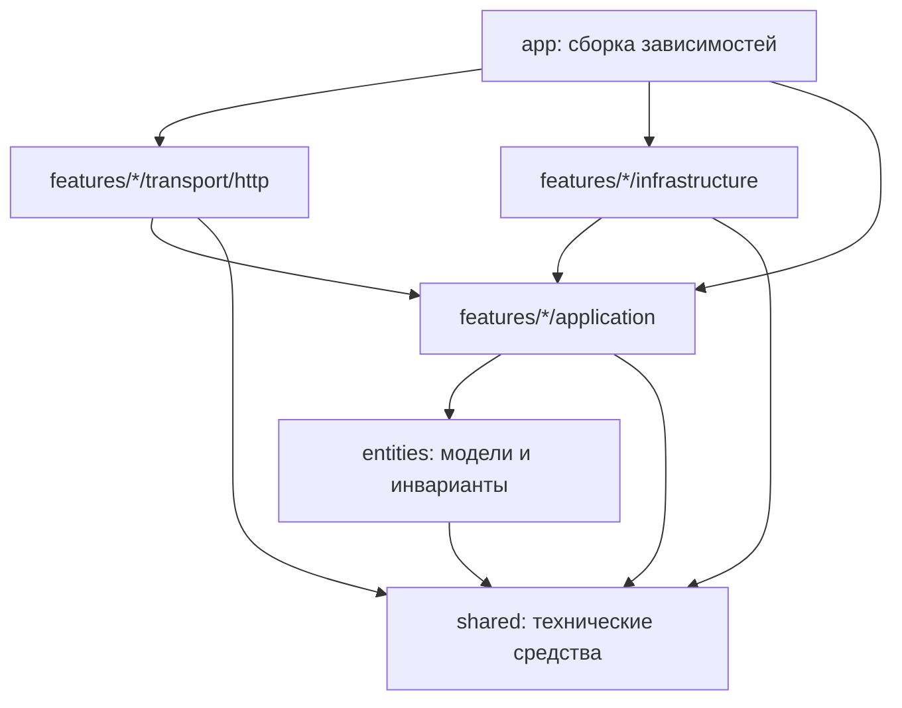

# Архитектура backend

Backend организован по функциональным срезам: `auth`, `voice`, `competency`.
Каждый срез содержит сценарии приложения, интерфейсы зависимостей и внешние адаптеры.
Слои `app`, `features`, `entities`, `shared` применяют принципы FSD к Go backend.
Официальная [методология FSD](https://github.com/feature-sliced/documentation/blob/main/src/content/docs/docs/get-started/overview.mdx)
описывает frontend; в backend её разделение по срезам сочетается с направлением зависимостей Clean Architecture.

Код сервиса находится в `services/backend` и имеет собственный Go-модуль.
Общие API-контракты остаются в корневом `api/`; Compose собирает сервис из его директории.

Дерево ниже относительно `services/backend`:

```text
cmd/api/                           запуск процесса и graceful shutdown
internal/
  app/                             конфигурация, сборка зависимостей, router/middleware
  features/
    auth/
      application/                 регистрация, вход, refresh, logout, доступ, порты
      infrastructure/
        postgres/                  пользователи, токены, транзакции и блокировки
        argon2/                    хеширование паролей
        hibp/                      HTTP-проверка известных утечек
      transport/http/              JSON DTO, cookies и auth handlers
    voice/
      application/                 распознавание, сохранение и синтез, порты
      infrastructure/
        postgres/                  сохранение расшифровок
        modelapi/                  HTTP-адаптеры GigaAM и VoxCPM2
      transport/http/              multipart/JSON, публичные DTO и WAV-ответ
    competency/
      application/                 доступ admin и сценарий импорта, порты
      infrastructure/
        csvparser/                 формат CSV и преобразование в доменную карту
        postgres/                  атомарная замена карты и номер revision
      transport/http/              загрузка CSV и публичный итог импорта
  entities/
    user/                          пользователь и роли
    session/                       сессия авторизации, состояния токенов и сроки
    transcription/                 расшифровка с владельцем
    audio/                         поддерживаемые контейнеры и инварианты WAV
    competencymap/                 карта компетенций и результат её замены
  shared/
    fault/                         ошибки приложения без HTTP-статусов
    security/                      генерация идентификаторов/токенов и SHA-256
    httpx/                         технические JSON/multipart/error helpers
    postgres/                      bootstrap-миграция PostgreSQL
```

## Направление зависимостей



Стрелки обозначают зависимости исходного кода. Во время выполнения сценарий вызывает
репозиторий или провайдер через интерфейс, определённый в `application`; конкретная
реализация передаётся из `app`. Сценарии не импортируют `net/http`, pgx, SQL, свои
HTTP handlers или адаптеры. Доменные модели не содержат HTTP/SQL зависимостей и JSON DTO.

Срезы `auth`, `voice`, `competency` не импортируют друг друга. Проверка сессии для
защищённых маршрутов выполняется в middleware, собранном в `app`: он получает пользователя
от auth-сценария и передаёт principal HTTP handler. Это позволяет voice и competency
получать пользователя, сохраняя независимость от реализации авторизации.

`shared` не импортирует доменные сущности и features. Он содержит общие механизмы,
а не учебные правила. Ошибки приложения классифицируются через `fault.Kind`;
преобразование в HTTP-статус выполняет `httpx`, а удаление cookies — auth transport.

## Владение правилами и транзакциями

Auth application определяет время жизни токенов, нормализацию email, парольную политику,
правила refresh/replay и пределы частоты запросов. PostgreSQL adapter реализует
транзакционный порт: блокирует строку сессии и повторно читает `used_at` после получения
блокировки. При replay сценарий сначала фиксирует отзыв сессии, затем возвращает ошибку.
Ошибка ответа не откатывает уже необходимый отзыв.

Voice application проверяет аудио/текст, связывает расшифровку с владельцем и сохраняет
только успешный результат. HTTP provider adapter отвечает за wire-формат моделей,
ограничения ответа, таймауты и преобразование ошибок провайдера.

Competency application проверяет admin и запускает импорт. CSV adapter проверяет
формат, наследует объединённые поля и сохраняет критерии без изменений.
PostgreSQL adapter выполняет замену карты одной транзакцией и последовательно выдаёт revisions.
HTTP-ручки, миграция и контракт API v0 сохраняют прежнее поведение.

## Проверка границ

`services/backend/internal/app/architecture_test.go` анализирует реальные Go imports и запрещает
зависимости между features, SQL-операции в composition root, инфраструктурные
зависимости в application/entities и обратные зависимости из shared.

Application-тесты используют порты и выполняются без PostgreSQL, HTTP и весов моделей.
Интеграционные тесты в `services/backend/internal/app` проверяют весь публичный API с реальным PostgreSQL,
а также OpenAPI-схемы и HTTPS cookie lifecycle. CSV parser и audio invariants имеют
собственные тесты рядом с реализацией.

Новый сценарий добавляется в свой feature. Новый провайдер или способ хранения
реализует существующий порт и подключается в `app`; application-код не меняется из-за
перестановки инфраструктуры. Сценарии следующих этапов API вводятся по мере реализации.
