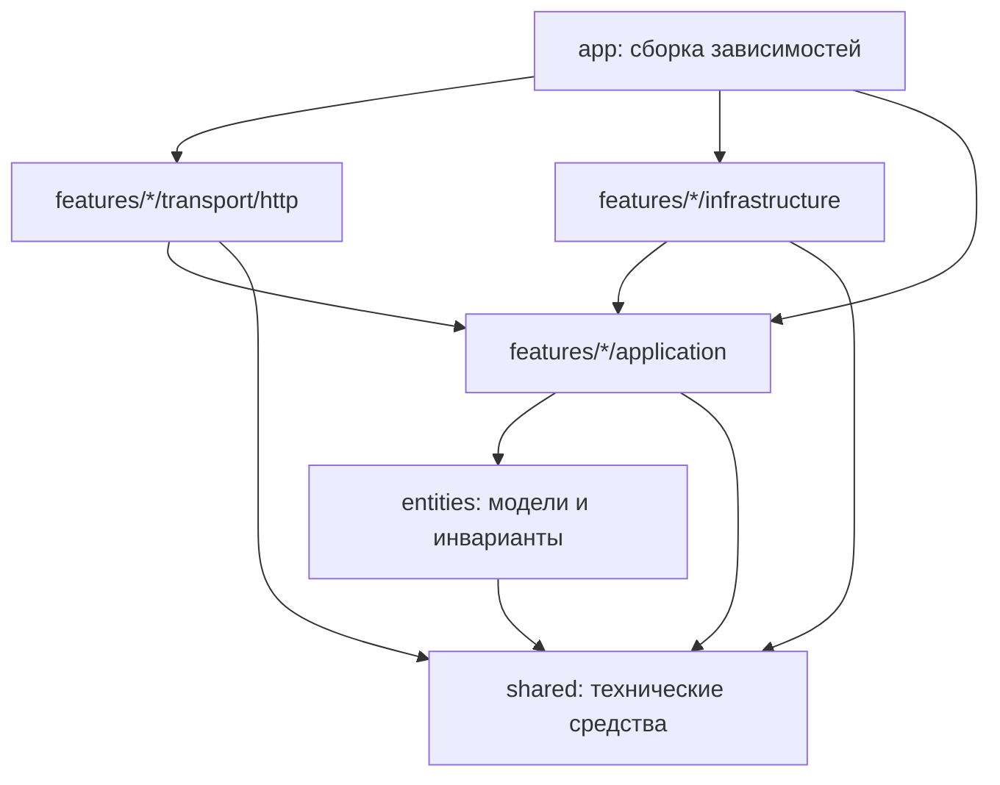

# Архитектура backend

Backend организован по функциональным срезам: `auth`, `voice`, `competency`, `assessment`.
Каждый срез содержит сценарии приложения, интерфейсы зависимостей и внешние адаптеры.
Слои `app`, `features`, `entities`, `shared` применяют принципы FSD к Go backend.
Официальная [методология FSD](https://github.com/feature-sliced/documentation/blob/main/src/content/docs/docs/get-started/overview.mdx)
описывает frontend; в backend её разделение по срезам сочетается с направлением зависимостей Clean Architecture.

Код сервиса находится в `services/backend` и имеет собственный Go-модуль.
Контракт реализованного API генерируется из Go-кода в `services/backend/backend.api.yaml`;
этапные контракты в корневом `api/` не используются backend. Compose собирает сервис из его директории.

Дерево ниже относительно `services/backend`:

```text
cmd/api/                           запуск процесса и graceful shutdown
internal/
  app/                             конфигурация, сборка зависимостей, router/middleware
  features/
    auth/
      application/                 регистрация, вход, refresh, logout, доступ, порты
      infrastructure/
        postgres/                  пользователи, токены, транзакции и блокировки
        argon2/                    хеширование паролей
      transport/http/              JSON DTO, cookies и auth handlers
    voice/
      application/                 распознавание, сохранение и синтез, порты
      infrastructure/
        postgres/                  сохранение расшифровок
        modelapi/                  HTTP-адаптеры GigaAM и VoxCPM2
      transport/http/              multipart/JSON, публичные DTO и WAV-ответ
    competency/
      application/                 доступ admin и сценарий импорта, порты
      infrastructure/
        csvparser/                 формат CSV и преобразование в доменную карту
        postgres/                  атомарная замена карты и номер revision
      transport/http/              загрузка CSV и публичный итог импорта
    assessment/
      application/                 проверка задания и оценки, порты расшифровки и модели
      infrastructure/postgres/     чтение расшифровки по владельцу
      infrastructure/modelapi/     вызов локальной LLM и разбор JSON-ответа
      transport/http/              синхронная прототипная ручка оценки
    taskbank/
      application/                 поиск и полный профиль без эталона
      infrastructure/postgres/     каталог и SQL-фильтры
      transport/http/              GET /tasks и GET /tasks/{id}
    taskgen/
      application/                 генерация, проверка и импорт материалов
      infrastructure/postgres/     атомарное сохранение генераций/RAG-связей
      infrastructure/modelapi/     OpenAI-совместимая генерация задач
      transport/http/              генерация задач и админский импорт материалов
  entities/
    user/                          пользователь и роли
    session/                       сессия авторизации, состояния токенов и сроки
    transcription/                 расшифровка с владельцем
    audio/                         поддерживаемые контейнеры и инварианты WAV
    competencymap/                 карта компетенций и результат её замены
  shared/
    fault/                         ошибки приложения без HTTP-статусов
    security/                      генерация идентификаторов/токенов и SHA-256
    httpx/                         технические JSON/multipart/error helpers
    postgres/                      Goose-миграции, SQL-запросы и sqlc-generated adapters
```

## Направление зависимостей



Стрелки обозначают зависимости исходного кода. Во время выполнения сценарий вызывает
репозиторий или провайдер через интерфейс, определённый в `application`; конкретная
реализация передаётся из `app`. Сценарии не импортируют `net/http`, pgx, SQL, свои
HTTP handlers или адаптеры. Доменные модели не содержат HTTP/SQL зависимостей и JSON DTO.

Срезы `auth`, `voice`, `competency`, `taskbank` и `taskgen` не импортируют друг друга. Проверка сессии для
защищённых маршрутов выполняется в middleware, собранном в `app`: он получает пользователя
от auth-сценария и передаёт principal HTTP handler. Это позволяет voice и competency
получать пользователя, сохраняя независимость от реализации авторизации.

`shared` не импортирует доменные сущности и features. Он содержит общие механизмы,
а не учебные правила. Ошибки приложения классифицируются через `fault.Kind`;
преобразование в HTTP-статус выполняет `httpx`, а удаление cookies — auth transport.

## Владение правилами и транзакциями

Auth application определяет время жизни токенов, нормализацию email, парольную политику,
правила refresh/replay. PostgreSQL adapter реализует
транзакционный порт: блокирует строку сессии и повторно читает `used_at` после получения
блокировки. При replay сценарий сначала фиксирует отзыв сессии, затем возвращает ошибку.
Ошибка ответа не откатывает уже необходимый отзыв.

Voice application проверяет аудио/текст, связывает расшифровку с владельцем и сохраняет
только успешный результат. HTTP provider adapter отвечает за wire-формат моделей,
ограничения ответа, таймауты и преобразование ошибок провайдера.

Competency application проверяет admin и запускает импорт. CSV adapter проверяет
формат, наследует объединённые поля и сохраняет критерии парного формата без изменений.
Для исходной карты ML он выделяет самостоятельные задания, а фрагменты сохраняет в архиве.
PostgreSQL adapter выполняет замену текущей иерархии одной транзакцией, архивирует исходные
строки по ревизиям и последовательно выдаёт revisions.

## Карта компетенций: подбор, RAG и генерация

Продуктовые решения согласованы **5 октября 2026**; схема, шаги и статус —
в [PLAN.md](../PLAN.md). Начальная миграция создаёт целевую типизированную схему без backfill,
связи РПД, происхождение заданий, генерации, фрагменты материалов и схему снимков выдач.
Текущая цепочка FK `tasks → outcomes → constituents → competencies` сохраняется.
«Инстанс» был условным названием набора связанных свойств; отдельная сущность для него
не требуется. Имена таблиц/полей — английские, тема определяется ОР.

Фильтруемые свойства ОР получают типизированное представление: `include_in_test`,
`taxonomy_id`, `ald_level_id`, `importance`. ОС соответствует ОР 1:1 и хранится в
`outcomes.educational_content`; отсутствие текста — `NULL`. Уровень темы и связи РПД
относятся к составляющей и наследуются её ОР. Коды компетенций РПД привязаны к конкретной
паре «составляющая–раздел»: у разных составляющих одного раздела наборы кодов могут отличаться.
Справочники и таблицы связей обеспечивают FK, исходные значения сохраняются в CSV-строках.

Все задания одного ОР имеют общий унаследованный профиль. Задания 1–3 — равнозначные
аналоги; пустая ячейка означает отсутствие задания. Непустые фрагменты сохраняются с
предупреждениями и не становятся самостоятельными вопросами. Отдельные ссылки исходных
строк на ОР нужны в том числе для ОР без заданий. Вопрос, варианты, голосовая инструкция,
эталон и критерии — отдельные поля задания; TTS получает только инструкцию.

| Запрос | Обязательное поведение |
| --- | --- |
| Профиль по `task_id` | ОР/ОС, составляющая, компетенция, уровень темы, таксономия, ALDs, важность, включение в тест, связки разделов/компетенций РПД, содержание и происхождение задания. |
| Подбор по свойствам | SQL-фильтры по этим связям/значениям, затем семантическое ранжирование при наличии индекса. Несколько связей РПД не дублируют вопрос. |
| Аналоги | Другие задания того же ОР с общим профилем, исключая уже выданные и исходный пример. |
| Генерация | Профиль/тема ОР, подходящие примеры и связанные материалы → новое задание того же ОР. |
| Поиск пробелов | Сохранённая оценка → ОР → составляющая/компетенция; непроверенный ОР не считается пробелом. |

Сгенерированные задания хранятся в общем банке с `origin=ai_generated`, авторские —
`origin=authored`. Успешно сохранённое задание ИИ сразу доступно студентам. Запуск хранит
модель, версию промпта, снимок профиля и ссылки использованных примеров/фрагментов.
LLM вызывается вне транзакции; перед атомарной записью результата проверяется ревизия
карты. Проверка структуры не равна гарантии правильности содержания. Эталон и критерии
доступны внутренним сценариям оценивания/генерации и исключены из студенческого каталога.

Для RAG PostgreSQL хранит отношения между ОР, разделами, заданиями и фрагментами материалов.
Фрагменты материалов связаны с ОР; текущая генерация извлекает их через PostgreSQL FTS.
Фрагменты неизменяемы: повторный импорт материала заменяет активные связи с ОР, а прежние
фрагменты остаются доступными историческим ссылкам уже завершённых и начатых генераций.
Замена карты инвалидирует старые связи и embeddings, сами фрагменты сохраняются и могут быть
привязаны к ОР новой карты повторным импортом материала.
Таблица `material_embeddings` хранит embedding, модель и ревизию, но embedding-провайдер и
семантический поиск пока не подключены. JSON используется для снимков и исходных строк;
рабочие фильтры и связи опираются на типы и FK. Свободные метаданные старого парного формата сохраняются в исходных строках со связями к ОР; распознаваемые свойства новый импорт записывает в типизированные поля.

Повторный импорт атомарно заменяет **все данные активной карты**, исходные строки и банк
обоих происхождений; связанные поисковые данные удаляются/инвалидируются. Счётчик
ревизии защищает от устаревших операций. Импорт заменяет активные исходные строки и банк.
Пользователи и расшифровки сохраняются. Таблицы сессий/назначений/ответов уже имеют поля
снимков, но маршрут прохождения и запись результатов ещё не подключены.

## Проверка границ

Прототипный `assessment` читает сохранённую расшифровку текущего студента, вызывает
OpenAI-совместимый локальный endpoint и возвращает проверенный балл с тремя строками
обратной связи. Оценка пока не сохраняется и не использует опубликованные рубрики.

`services/backend/internal/app/architecture_test.go` анализирует реальные Go imports и запрещает
зависимости между features, SQL-операции в composition root, инфраструктурные
зависимости в application/entities и обратные зависимости из shared.

Application-тесты используют порты и выполняются без PostgreSQL, HTTP и весов моделей.
Интеграционные тесты в `services/backend/internal/app` проверяют весь публичный API с реальным PostgreSQL,
а также OpenAPI-схемы и HTTPS cookie lifecycle. CSV parser и audio invariants имеют
собственные тесты рядом с реализацией.

Новый сценарий добавляется в свой feature. Новый провайдер или способ хранения
реализует существующий порт и подключается в `app`; application-код не меняется из-за
перестановки инфраструктуры. Сценарии следующих этапов API вводятся по мере реализации.
